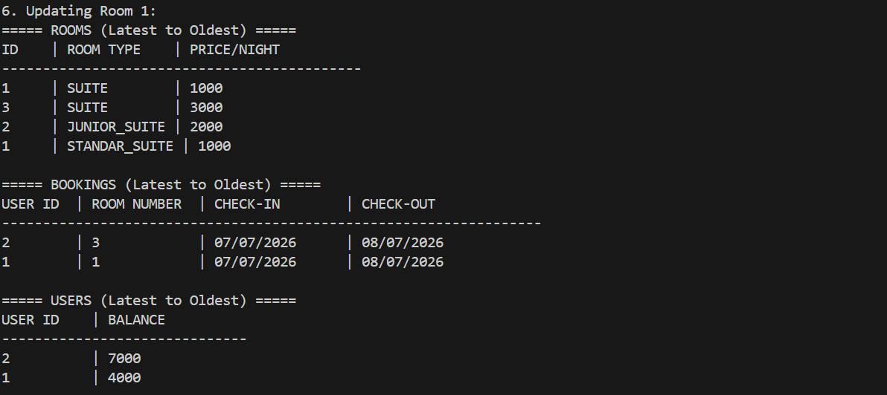

# output



# Design Questions Analysis

## Question 1: Single Service Approach

**Is putting all functions in the same service the recommended approach?**

**Answer: Not recommended for production systems.**

### Better Approach
Implement separate services:
- `UserService`
- `RoomService` 
- `BookingService`

### Justification
This violates the **SOLID Principles**, specifically the **Single Responsibility Principle**, which states that each class should have only one purpose and one reason to change.

### Benefits of Separated Services
- **Maintainability**: Each service focuses on its specific domain
- **Testability**: Easier to unit test individual components
- **Scalability**: Services can be scaled independently
- **Code Organization**: Clear separation of concerns

---

## Question 2: Room Update Strategy

**Alternative approaches to `setRoom()` that doesn't impact previous bookings**

### Current Approach
The `setRoom()` function updates room properties without affecting historical bookings by storing snapshots.

### Alternative: Room Configuration History

Instead of updating room properties directly, implement a configuration history system:

```java
room.addConfiguration(roomType, price, effectiveDate)
```

### Key Features of Configuration History Approach

#### 1. **Historical Tracking**
- Maintain complete history of all room changes over time
- Track when each change was made
- Enable future data analysis and reporting

#### 2. **Database Coherence**
- Prevents ID duplication issues
- Ensures data integrity in relational databases (PostgreSQL, MySQL)
- Maintains unique ID constraints required by RDBMS

#### 3. **Multiple Relationship Management**
- Create relationships between room entities and their configurations
- Each room can have multiple configuration entries
- Bookings reference specific room configurations

### Implementation Structure
```java
class Room {
    private int roomId;
    private List<RoomConfiguration> configurations;
}

class RoomConfiguration {
    private RoomType type;
    private int price;
    private Date effectiveFrom;
    private Date effectiveTo;
}
```

### Benefits
- **Data Integrity**: No risk of losing historical pricing information
- **Audit Trail**: Complete change history for compliance
- **Analytics Ready**: Historical data available for business intelligence
- **Database Friendly**: Follows relational database best practices
- **Fair Billing**: When users pay, system references the original pricing they agreed to, ensuring customers pay exactly what they booked for